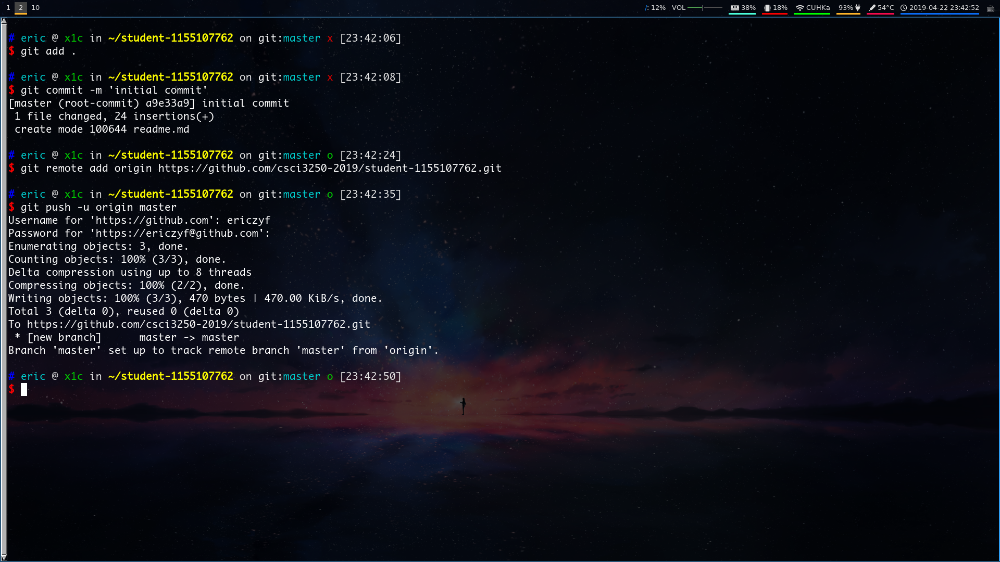

# CSCI3250 Project Milestone 2

## Basic Information
**Name**: Yifan Zhang  
**College**: United College  
**Major**: Computer Science  

| Key               | Value  |
|-------------------|--------|
| Favorite Game     | CS:GO  |
| Favorite Language | Rust   |
| Favorite Editor   | VSCode |

## Programming Experience
* C/C++
* Java
* JavaScript
* Python
* Rust

## Task List
- [x] Project Milestone 1
- [x] Project Milestone 2
- [x] Project Milestone 3

## Screenshot

